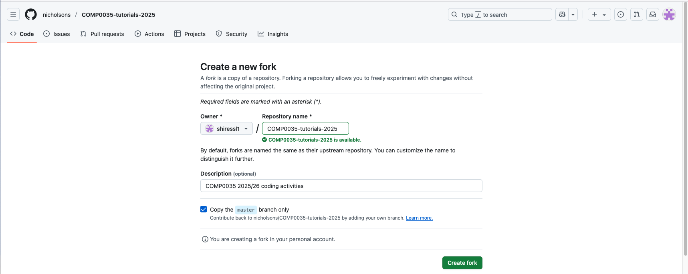

# Activity 4: Set up the COMP0035 coding activities project

## Create a copy of the repository using the 'fork' method

A 'fork' is a copy of a repository. Forking a repository allows you to freely experiment with changes without affecting
the original project. You can fork a repository to propose changes to someone else's project or to use someone else's
project as a starting point for your own idea.

Go to the [https://github.com/nicholsons/COMP0035-tutorials-2025](https://github.com/nicholsons/COMP0035-tutorials-2025)
repository.

1. Click on the 'Fork' button in the top right of the page.

   

2. Select 'Create a new fork' then 'Create fork'.

   

   You may see a temporary screen while the fork is created.

3. You will be taken to your new forked repository once created. The URL will be in the format
   `yourusername/comp0035-tutorials-2025`.

   

**IMPORTANT**: This repository will be updated weekly with new activities. If there have been changes, you will see a
message showing the branch is out of date e.g. "This branch is 1 commit behind...". Select the green 'Update branch'
button to pull the latest updates to your copy of the repo.


## Create a new project in your IDE

You will create a local copy, called a **clone**, of the repo you just created in your IDE. Make sure you use your
forked copy and not the course master as you won't then be able to synch your changes.

### VS Code

In VS code you have options to open remotely on GitHub, open in codespaces (online IDE), or clone. The following
summarises the last approach.

Use the [VS Code documentation](https://code.visualstudio.com/docs/sourcecontrol/github#_cloning-a-repository) which has
the latest screenshots and guidance.

NB If you have [integrated your IDE with GitHub](1-07-opt-integrate-IDE-GitHub.md) then it may give you a list of
your repos to choose from. If not then you may be prompted to log in.

- Select the source code control icon in the left nav bar (3 circles connected with 2 lines)
- Select 'clone repository'
- Enter your GitHub repo URL e.g. `yourusername/comp0035-tutorials-2025` replacing yourusername with your actual GitHub
  username
- When prompted, choose the location where you want the repo to be saved on your computer then press "Select as
  Repository Destination".
- VS Code will create a subfolder within the selected destination for the project you are cloning.
- At the prompt to 'would you like to open the cloned repo' select Open.

### PyCharm

Use
the [PyCharm documentation](https://www.jetbrains.com/help/pycharm/manage-projects-hosted-on-github.html#clone-from-GitHub)
which has
the latest screenshots and guidance.

NB If you have [integrated your IDE with GitHub](1-07-opt-integrate-IDE-GitHub.md) then it may give you a list of
your repos to choose from. If not then you may be prompted to log in.

Summary of steps:

- Menu option File > Project from version control
- Enter your GitHub repo URL e.g. `yourusername/comp0035-tutorials-2025` replacing yourusername with your actual GitHub
  username and select the folder you want this to be saved to on your computer then select Clone
- When asked if you want to create a venv from requirements.txt say yes (otherwise you will have to create it yourself)!

## Setup the virtual environment

If using VS Code then refer to activity 2 and complete these steps:

- Create and activate a venv
- Install dependencies from requirements.txt
- Install the project code

If you used PyCharm as above then the venv will have been created already and the packages installed from
requirements.txt so you only need to install the project code.

Summary of commands if using the Terminal:

MacOS

```bash
python3 -m venv .venv
source .venv/bin/activate
pip install -r requirements.txt
pip install -e .
```

Windows

```bash
py -m venv .venv
.venv\Scripts\activate
pip install -r requirements.txt
pip install -e .
```

[Next activity](1-05-coursework-repo.md)