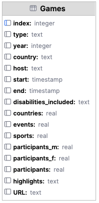
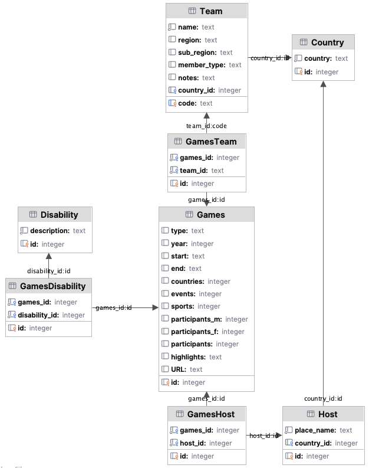

# Normalisation and application development

Normalisation helps keep your data clean and consistent, but can make your queries more complex and sometimes slower.
The right balance depends on your application's needs.

## Why normalise a SQL database

- Reduces data redundancy: Normalisation reduces or eliminates duplicate data, saving storage and making updates easier.
- Improves data integrity: By organizing data into related tables, it is easier to enforce consistency and avoid
  anomalies e.g., update, insert, delete anomalies.
- Easier maintenance: Changes to data structures or values may be simpler and less error-prone.

## Potential disadvantages of normalisation

- Complex queries: Highly normalised databases often require more complex queries to retrieve related data. Tables need
  to be joined together in the queries.
- Performance overhead: JOIN operations can slow down read-heavy applications, especially with large datasets.
- Design complexity: Designing a fully normalised schema can be more time-consuming and may require deeper understanding
  of the data and its relationships.

## Example using the paralympics database

Two versions of the paralympics database have been created, one that has been normalised and one that has not.

The code in [compare_queries.py](../../src/activities/starter/compare_queries.py) can be run to show the time taken to
run each query.

### Un-normalised database

[para-not-normalised.sqlite](../../src/activities/data/para-not-normalised.sqlite)



Query to find all details of the 2012 London Games:

```sql
SELECT *
FROM Games
WHERE type = 'summer'
  AND year = 2012
```

Queries timed on 3 executions: 0.000085 seconds, 0.000090 seconds, 0.000128 seconds

### Normalised database

[paralympics-normalised.db](../../src/activities/data/para-normalised.db)



Query to find all details of the 2012 London Games:

```sql
SELECT g.type,
       g.year,
       c.country,
       h.place_name                      AS host,
       g.start,
       g.end,
       GROUP_CONCAT(d.description, ', ') AS disabilities_included,
       g.countries,
       g.events,
       g.sports,
       g.participants_m,
       g.participants_f,
       g.participants,
       g.highlights,
       g.URL
FROM Games g
         JOIN GamesHost gh ON g.id = gh.games_id
         JOIN Host h ON gh.host_id = h.id
         JOIN Country c ON h.country_id = c.id
         LEFT JOIN GamesDisability gd ON g.id = gd.games_id
         LEFT JOIN Disability d ON gd.disability_id = d.id
WHERE h.place_name = 'London'
  AND g.year = 2012
GROUP BY g.id, c.country, h.place_name
```

Queries timed on 3 executions: 0.000124 seconds, 0.000122 seconds, 0.000123 seconds
