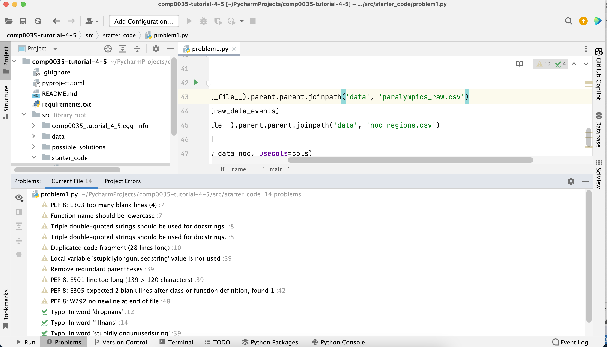
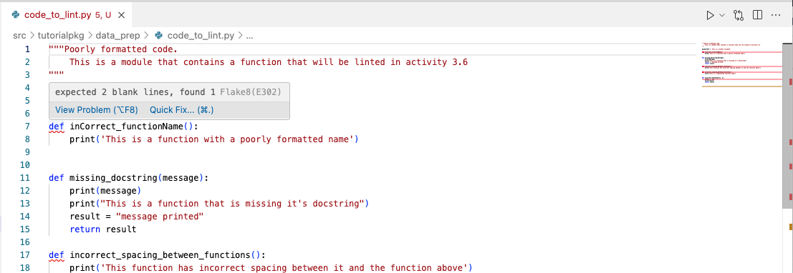

# 2. Using linters to check your code style

**Linting** in Python refers to the process of running a program that analyzes your code for potential errors, stylistic
issues, and bugs. It's a little like having a spelling and grammar checker for your code.

A **Linter** is a Python tool that analyses Python code to detect potential errors, stylistic issues, and violations of
coding standards

Python styles are documented in standards or style guides. The main style guide
is [PEP8](https://peps.python.org/pep-0008/); you also saw [PEP257 for docstrings](https://peps.python.org/pep-0257/) in
the previous activity. Adhering to standards helps you and others to read your code.

The PyCharm IDE by default includes a linter. For the VS Code IDE you need to install linter.

Popular Python linters include:

- [ruff](https://pypi.org/project/ruff/)
- [Pylint](https://pypi.org/project/pylint/)
- [Flake8](https://pypi.org/project/flake8/)

Each has its own set of rules and configurations.

Some of the things that linters can help with:

- **Error Detection**: Linters can catch syntax errors, undefined variables, and other common mistakes.
- **Code Style**: They help ensure your code adheres to a consistent style guide (e.g. PEP8), making it more readable
  and maintainable.
- **Best Practices**: Linters can suggest improvements based on best practices, such as avoiding certain patterns that
  might lead to bugs or performance issues.

## Activity: Use linter to find style issues

1. Install these linters in your virtual environment: `pip install flake8 pylint ruff`
2. Lint the file in [cq_code_to_lint.py](../../src/activities/starter/cq_code_to_lint.py) with flake8:
   `flake8 src/activities/starter/cq_code_to_lint.py`
3. Repeat using pylint: `pylint src/activities/starter/cq_code_to_lint.py`
4. Repeat using ruff: `ruff check src/activities/starter/cq_code_to_lint.py`
5. The three linters report slightly different issues:

```text
(.venv) flake8 src/activities/starter/cq_code_to_lint.py
src/activities/starter/cq_code_to_lint.py:2:80: E501 line too long (81 > 79 characters)
src/activities/starter/cq_code_to_lint.py:7:1: E302 expected 2 blank lines, found 1
src/activities/starter/cq_code_to_lint.py:17:1: E302 expected 2 blank lines, found 1
src/activities/starter/cq_code_to_lint.py:18:80: E501 line too long (82 > 79 characters)
src/activities/starter/cq_code_to_lint.py:21:1: F811 redefinition of unused 'incorrect_spacing_between_functions' from line 17
src/activities/starter/cq_code_to_lint.py:26:13: E222 multiple spaces after operator
src/activities/starter/cq_code_to_lint.py:28:18: W292 no newline at end of file

(.venv) pylint src/activities/starter/cq_code_to_lint.py
************* Module src.activities.starter.cq_code_to_lint
src/activities/starter/cq_code_to_lint.py:28:0: C0304: Final newline missing (missing-final-newline)
src/activities/starter/cq_code_to_lint.py:5:0: C0103: Constant name "globalTEST" doesn't conform to UPPER_CASE naming style (invalid-name)
src/activities/starter/cq_code_to_lint.py:7:0: C0116: Missing function or method docstring (missing-function-docstring)
src/activities/starter/cq_code_to_lint.py:7:0: C0103: Function name "inCorrect_functionName" doesn't conform to snake_case naming style (invalid-name)
src/activities/starter/cq_code_to_lint.py:11:0: C0116: Missing function or method docstring (missing-function-docstring)
src/activities/starter/cq_code_to_lint.py:17:0: C0116: Missing function or method docstring (missing-function-docstring)
src/activities/starter/cq_code_to_lint.py:21:0: C0116: Missing function or method docstring (missing-function-docstring)
src/activities/starter/cq_code_to_lint.py:21:0: E0102: function already defined line 17 (function-redefined)
src/activities/starter/cq_code_to_lint.py:25:0: C0116: Missing function or method docstring (missing-function-docstring)

-----------------------------------
Your code has been rated at 1.88/10

(.venv) ruff check src/activities/starter/cq_code_to_lint.py 
F811 Redefinition of unused `incorrect_spacing_between_functions` from line 17
  --> src/activities/starter/cq_code_to_lint.py:21:5
   |
21 | def incorrect_spacing_between_functions():
   |     ^^^^^^^^^^^^^^^^^^^^^^^^^^^^^^^^^^^ `incorrect_spacing_between_functions` redefined here
22 |     print("This is a duplicated function name")
   |
  ::: src/activities/starter/cq_code_to_lint.py:17:5
   |
15 |     return result
16 |
17 | def incorrect_spacing_between_functions():
   |     ----------------------------------- previous definition of `incorrect_spacing_between_functions` here
18 |     print('This function has incorrect spacing between it and the function above')
   |
help: Remove definition: `incorrect_spacing_between_functions`

Found 1 error.
```

### Configuring the linter

You will need to refer to the documentation for the linter you are using for methods to configure the linter, for
example [the ruff documentation](https://docs.astral.sh/ruff/configuration/). You can typically configure the linter
when you run it from the command line, or in a configuration file such as `pyproject.toml`.

For this course, consider adding any configuration to `pyproject.toml`.

For example, if you are following the Google style guide, it suggests line length of 80 characters rather than the PEP8
specification of 79 characters so you might set the linter to flag warnings only if your line length is greater than 80.
Some developers prefer a longer line length such as 88 or 100 characters.

Examples of how you can set this config in `pyproject.toml`:

```toml
# Pylint configuration
[tool.pylint]
max-line-length = 80 # Default is 79 (PEP8 standard length)
good-names = ["i", "j", "df", "x", "y"]  # Prevents variable name warnings for these common names that don't meet PEP8

# Flake8 configuration
[tool.flake8]
max-line-length = 100  # Default is 79 (PEP8 standard length)

# Ruff configuration
[tool.ruff]
line-length = 100 # Default is 88
```

As well as configuring what the reporter will lint or ignore, you could also install additional packages to format the
output, for example [flake8-html](https://pypi.org/project/flake8-html/) to output to html format report.

## Fixing issues with a formatter

The purpose of using is a linter is to identify the issues. The benefit however is only achieved once you fix the
identified issues. Running a linter is the easy part, the challenge is to then fix the identified issues.

Formatters are packages that will autoformat your code, e.g.

- [ruff](https://pypi.org/project/ruff/) - ruff can be used to detect and correct
- [Black](https://black.readthedocs.io/en/stable/)
- [autopep8](https://pypi.org/project/autopep8/) that you may wish to explore.

The tools use rules and correct your code to meet these. You may not always agree with the rules

PyCharm has options that will correct your code. If you are using PyCharm, try opening the code_to_lint.py and go to the
menu option 'Code | Format Code' and it should correct the spacing, line break and any indentation issues.

Both PyCharm and VS Code, particularly when you combine them with Copilot, will warn of style issues and offer
solutions.

Typically, where you see an error (by default a red squiggly underline in VS Code, or highlighted code in PyCharm, or a
lightbulb symbol); then the IDE will help you to fix it. Usually, clicking on the lightbulb will tell you what is wrong
and if possible, offer to fix it for you.

You will need to refer to the documentation for your IDE to work out how to identify warnings and use linting:

- [VS Code linting](https://code.visualstudio.com/docs/python/linting)
- [VS Code identify warnings](https://code.visualstudio.com/Docs/editor/editingevolved#_errors-warnings)
- [PyCharm Python code inspections](https://www.jetbrains.com/help/pycharm/running-inspections.html)
- [PyCharm fix problems](https://www.jetbrains.com/help/pycharm/resolving-problems.html)

Example of PyCharm style warnings, click on the warning triangle in the upper right of the code pane:



Example of VS Code style warning, hover over the squiggle to see the options:



NB: In VS Code, the warnings will not disappear as soon as you correct the code, you need to save the changes. The
linter appears to run only on save.

## Activity: Use a formatter to correct issues

Run commands in the terminal virtual environment.

1. Make a copy of [cq_code_to_reformat.py](../../src/activities/starter/cq_code_to_reformat.py) - this is just so you
   can repeat the activity later if you want. Open the file to see the issues but do not correct anything.
2. Run a linter: `flake8 src/activities/starter/cq_code_to_reformat.py`
3. Install autopep8: `pip install autopep8`
4. Auto-format the file: `autopep8 --in-place --aggressive --aggressive src/activities/starter/cq_code_to_reformat2.py`
5. Run a linter again: `flake8 src/activities/starter/cq_code_to_reformat.py`. Fewer issues should be reported.
6. Open the file again and see the changes that have been made.

[Next activity](4-03-github-actions.md)