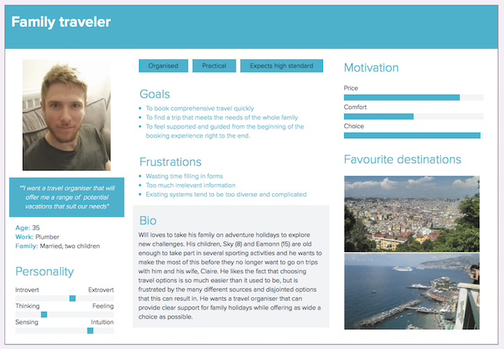

# Introduction to personas

This guide provides an introduction to using personas to describe the target audience for a product.

## What is a target audience and why do you need to know this?

In the coursework you:

- write questions that you will attempt to answer by analysing data
- design web apps that use data visualisation and machine learning

For each of these it will be important to know who are writing or designing for, ie who is the **target audience**. This
will influence decisions that you make.

It is also useful to have a commonly understood picture of the target audience when working with others on a project.
Even if you are working alone for the coursework, the PGTAs and tutor will need to have a shared understanding of your
target audience in order to assess the effectiveness of your proposed solutions.

There are techniques, mostly from interaction design, product development and software development, that can be used to
describe the target audience. The most common is to create a **persona** which is what this guide will focus on. The
purpose of personas is to create reliable and realistic representations of your key audience segments for reference.

## What is a persona?

Rogers, Sharp and
Preece ([Interaction Design](https://web-b-ebscohost-com.libproxy.ucl.ac.uk/ehost/ebookviewer/ebook/bmxlYmtfXzIwOTczNDBfX0FO0?sid=9a19bda6-f2c8-444d-a608-11a5fe3fa5c4@sessionmgr102&vid=0&format=EB&lpid=lp_471&rid=0))
describe personas as

> "...rich descriptions of the typical users of the product under development on which the designers can focus and for
> which they can design products. They don't describe specific people, but rather they are realistic, and not
> idealized."
>
> "Each persona is characterised by a unique set of goals relating toe the particular product under development, rather
> than a job description or a simple demographic. This is because goals often differ among people within the same job
> role or the same demographic."

The following example of a persona for a group travel app is taken from their book.



## How to create a persona

The following provides a generic set of steps. There are plenty of guides to creating personas that will contain
variations on this, and you may use any that you feel are appropriate.

Some guides to creating a persona also include a step to consider scenarios or situations in which the personas would
use your product. You could research this aspect further if you wish.

### Identify the people are you will use the product (web apps) you are going to create

Consider the target audience, often called the 'user' or 'users' of the apps you intend to create. Your target audience
may have distinct segments.

A persona should be a reliable and realistic representation of the target audience segments. You may therefore have a
few personas if you have more than one segment in your target audience.

List the target audience, or target audience segments if these exist.

### Collect information about the target audience

Personas should be realistic, i.e. based on real data. You would carry out research to find out about them, and then
analyse the results of that research before drawing conclusions. However, you cannot do that for this course as such
research requires ethics approval. Instead, you will have to imagine their characteristics.

Personas generally include the following items of information:

- Persona role (i.e. web manager)
- An image/photo
- A fictional name
- Job title, role and major responsibilities
    - What is their profession?
    - How much experience do they have?
- Demographics such as age, education level, ethnicity, and family status
- The goals and tasks they are trying to complete using the site
    - What do they want to understand or know about?
    - What are their goals?
    - What are their needs?
- Their physical, social, and technological environment
    - Are they getting similar information about the problem elsewhere? If so where? (could be from other people, apps,
      website etc.)
    - When are where are they likely to access your app?- What devices do they use? Particularly what devices do they
      use to access the web?
    - What apps do they use?
    - How much time do they spend using web apps each day? What is their experience in using web apps?
- A quote that sums up what matters most to the persona as it relates to your site

The following links contain guidance on further questions you could ask:

- [Usability.gov](https://www.usability.gov/how-to-and-tools/methods/personas.html) - scroll down to 'Questions to ask
  during persona development'
- [Smashing magazine](https://www.smashingmagazine.com/2014/08/a-closer-look-at-personas-part-2/#overview)

### Create the persona

There is no set format and there are many freely available templates available online (though many require you to
provide an email address).

Some templates, online persona generators and guides (note some may require you to create an account):

- [Career foundry](https://images.careerfoundry.com/public/resources/persona_template_ux_design_careerfoundry.pdf)
- [Persona generator](https://personagenerator.com/)
- [Hubspot make my persona](https://www.hubspot.com/make-my-persona)
- [UX persona template to download](https://www.behance.net/gallery/101462021/UX-User-Persona-Template) - select the
  download option, zip contains various formats

There are many more online if you search; or make your own layout using PowerPoint, Word or any other software.

Remember the limitations of gen AI tools if you use this approach to generate a persona. 

Gen AI tools may be useful to give you a starting point for generating a persona e.g.:

```text
Generate a persona for a UK school student aged 11-16. This is for a project to design and develop a web app with statistics and information about paralympic games.
```
### Review and refine

Having created the persona you would then review that, likely within an organisation and with its current or potential
customers.

### Use and maintain them!

You would then make sure the personas are shared with others in the project.

Remember to keep using the persona throughout the project. It helps you to keep focus on who are you designing for and
their needs.

Finally, personas are intended to be a living document, that is they should be reviewed and updated when needed.

