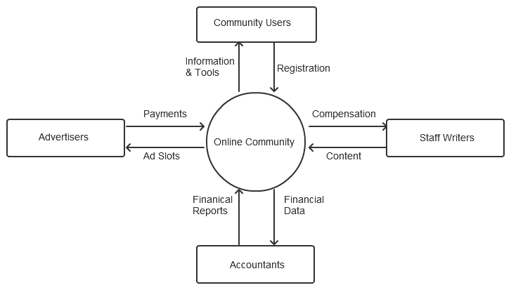

# Use cases
## Introduction

Use cases are used to describe the interactions between the system and the external users of that system (called actors)
that allows those actors to achieve particular goals.

Use cases are not necessarily an alternative to user stories or requirements, they can be used as an additional
requirement analysis technique to provide a richer picture of how the system is intended to meet the actors goals.

They use terminology that is consistent with object-oriented design and UML, though you do not have to adopt those
methods in order to use and make use of use cases.

## General steps to create use cases

There is no specific method, however the general steps to creating use cases are:

1. Determine the system boundary. A context diagram may be useful for this such as the following example
   from [modern analyst](https://www.modernanalyst.com/Careers/InterviewQuestions/tabid/128/ID/1433/What-is-a-Context-Diagram-and-what-are-the-benefits-of-creating-one.aspx)

   
2. Find the actors (i.e. who or what uses the system) and their goals
3. For each goal:
    - write the main success scenario
    - list the variations and the failure extensions
4. Review (merge trivial use cases, split up long complex use cases)
5. Iterate!

UML does not specify a format for documenting use cases. Martin Fowler in UML Distilled suggests you aim to keep it
brief and easy to read.

A common template you may see used is:

| Name               | Use case name/title                                    |
|:-------------------|:-------------------------------------------------------|
| ID                 | ID code, e.g. UC5                                      | 
| Brief Description  | One sentence overview                                  | 
| Primary Actor(s)   | Actor(s) that invoke the use case                      | 
| Secondary Actor(s) | Actor(s) that are invoked by the use case              | 
| Pre-conditions     | Conditions that need to be true before use case starts | 
| Main Flow          | Interaction between system and actor(s)                | 
| Post-conditions    | Conditions that need to be true after use case ends    | 
| Alternative Flows  | Alternative interactions to those in the main flow     | 

## UML use case diagram

A use case diagram is distinct from the use cases. It provides an overview of the uses cases. Unlike the use cases which
have no predefined format, the use case diagram is a UML diagram and has a given notation.

The following symbols are used.

- The **system** that the use cases are for is drawn as a rectangle. The actors are outside the system so are drawn
  outside the rectangle. The use cases are inside the system so inside the rectangle.
- An **actor** is an entity (e.g. person, external system) that plays a role in one or more interactions with your
  system. Actors are most commonly drawn as a stick figure, though can also be shown as a stereotype.

  

- A **use case** is drawn as an ellipse.
- An **association** is the relationship between an actor and a business use case and is drawn as a line (without an
  arrow head except for includes and extends).
    - An **include** relationship is between two use cases that signifies that the use case on the side to which the
      arrow points is included in the use case on the other side of the arrow. This means that for one functionality
      that the system provides, another functionality of the business system is accessed.
    - An **extends** relationship is used when a use case adds steps to another use case. The extended use case is at
      the arrowhead end.

[This website](https://www.edrawmax.com/article/use-case-diagram-uml.html) shows how the elements of a use case diagram are drawn.