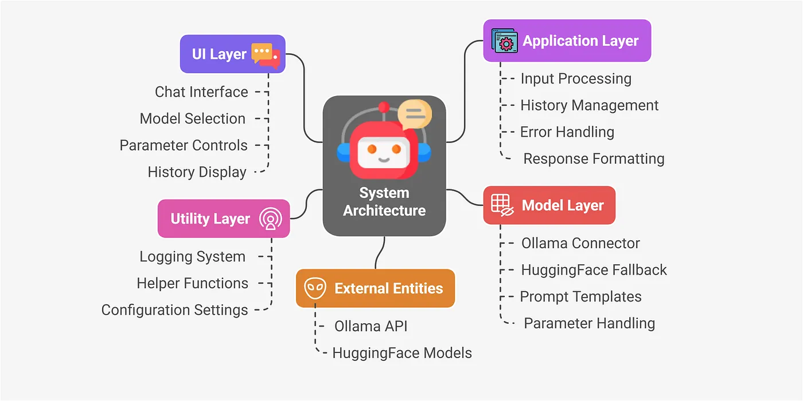

# Application design diagram examples

These examples are intended to make you think about your app and how you might want to design its structure. There is
no single correct way. For the coursework, it is important that you are able to explain why you chose to design your app
in a given way.

Note that simply repeating my comments below in your coursework is not appropriate.

## REST API (UML)

An application programming interface (API) defines the rules that you must follow to communicate with other software
systems. A REST or RESTful API is an interface that two computer systems use to exchange information over the internet.

REST is an architectural style for designing networked applications to communicate over the internet using standard HTTP
methods.

A REST API allows clients (like web or mobile apps) to interact with servers using HTTP requests.

Common HTTP methods used:

- GET – retrieve data
- POST – send data to create something
- PUT – update existing data
- DELETE – remove data

Each resource (like a user, product, or article) is typically represented by a URL, and responses are usually in JSON
format.

Consider this class diagram for a REST api.

Source: [Lucid](https://lucid.co/templates/uml-api-diagram-example)

The diagram shows how the REST HTTP methods, with route (url) names and the data attributes. This design is useful to
another developer who wants to make use of information about a product, or an order, etc in their own application.

It does not however describe an online shopping app. The methods for a user to search a product, place an order etc. are
not represented. You would need an additional diagram.

## Dashboard app (UML)

This next diagram
from [Jorge Simoes](https://www.researchgate.net/figure/Dashboard-and-Player-Profile-Class-Diagram_fig31_292720849)
shows the design of a dashboard application. The classes in the diagram don't show the attributes and methods (which you
would need to include for the coursework), however it shows how he intends to structure the app code.

## C4

C4 describes software architecture at 4 levels, and the diagrams are used in combination.

To view, have a look at some of the examples online:

- [Freecodecamp tutorial](https://www.freecodecamp.org/news/how-to-create-software-architecture-diagrams-using-the-c4-model/#heading-diagrams-as-code)
  and [GitHub repo displaying the diagrams](https://plutov.github.io/c4-diagram-example/master/task-management-system/context/)
- [Dev.to example of C4 diagrams for Google maps](https://dev.to/anwaar/c4-model-real-world-example-with-google-maps-3ano)

There are few examples that illustrate the code level; for the coursework you need to include code level diagram (but
not code).

## Other (neither C4 nor UML)

### 'Module'

The author describes this as a module diagram for a dashboard web app.

Source: [Frontend at scale](https://frontendatscale.com/issues/17/)

The diagram shows how the dashboard generally relates to the API, though it omits detail such as what the functions are
that are needed for the features of the dashboard.

It uses the wireframes in the diagram, but doesn't have to. The author notes these could be rectangles.

This gives a clear picture of the overall structure, but lacks sufficient detail for you to determine if the design of
the code meets principles of good design. You could consider combining this with a further diagram to show the next
level of detail.

## Layer

the following is
from [Shanoj on Medium](https://blog.stackademic.com/build-a-local-llm-powered-q-a-assistant-with-python-ollama-streamlit-no-cloud-required-800af31ce0bb)

This diagram represents a design separated into layers.

Again it lacks the detail of what is in each of the components e.g. what functions or classes does the chat interface?
What are the parameters included in the parameter controls? Neverthless the overall design pattern is clear from the
diagram.

## Streamlit multi page dashboard app

[This blog post](https://blog.streamlit.io/how-to-build-an-interconnected-multi-page-streamlit-app/#code-structure-structuring-for-scalability-and-modularity)
is quite long and does not have an overall diagram, yet shows how other techniques can be used.

The table in the 'session states' section shows how a table could be used rather than a more visual diagram to
show the attributes and functions needed for each page in a multipage dashboard.

The models in this article are shown as terminal style text rather than a class diagram - may be a personal opinion but
I found this format harder to read than a class style rectangle with attributes.

## Summary

Whichever technique you use to represent the design, the most important aspect of the application design is the thought
and reasoning in determining the structure the app and the contents. The next activities walk through activities that
can help you decide what the app needs to include.

[Next activity](7-03-identify-classes.md)

