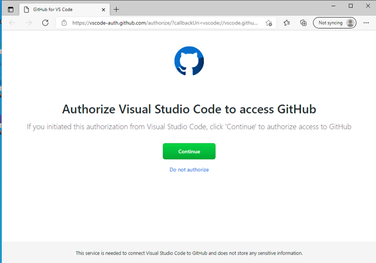
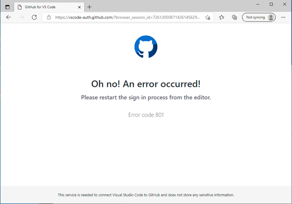
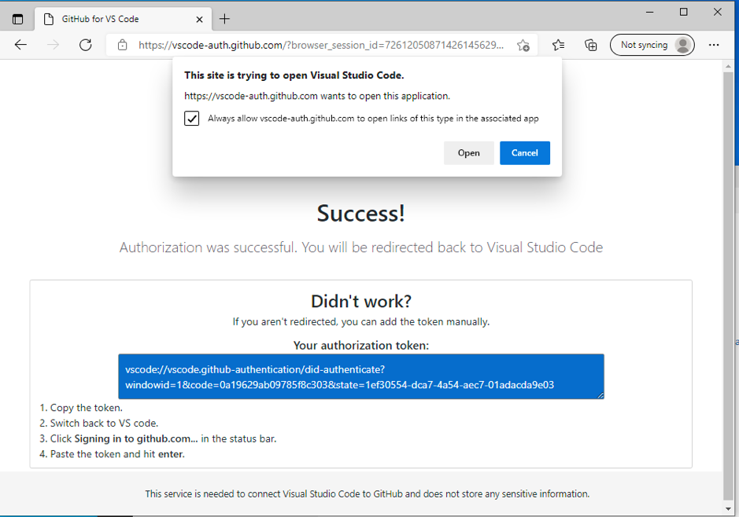
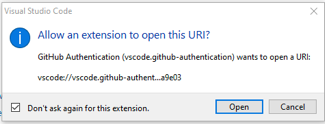
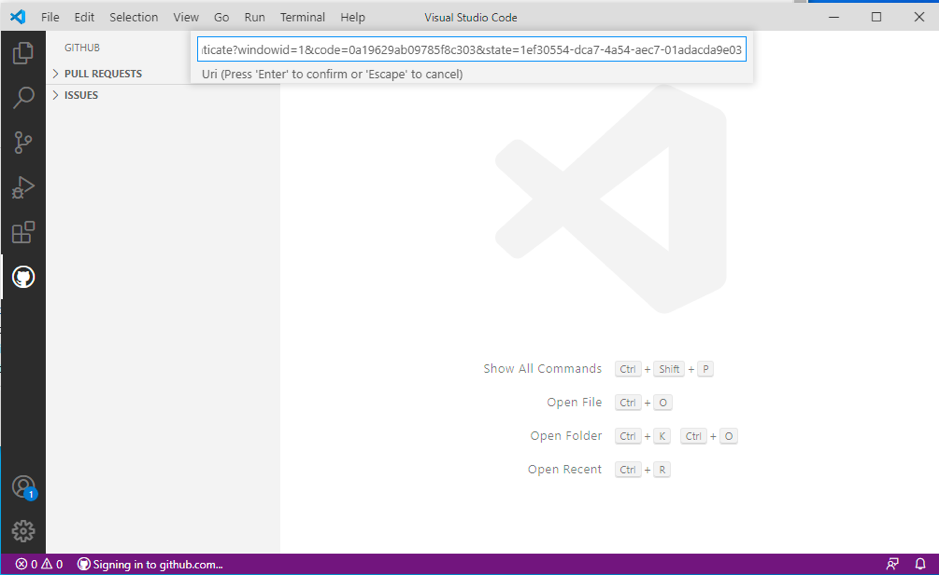

# Optional: Integrate your IDE with your GitHub account

You will be creating and editing files in your IDE and so you need to enable it to work with GitHub to manage your code.

You will add authorisation in GitHub to allow your IDE to access your GitHub account using
a [GitHub personal access token](https://docs.github.com/en/authentication/keeping-your-account-and-data-secure/managing-your-personal-access-tokens)
.

How you integrate your IDE with GitHub is specific to the particular IDE, so follow the relevant documentation to
complete this:

- [VS Code GitHub documentation](https://code.visualstudio.com/docs/editor/github)
- [PyCharm Register an existing account with a token](https://www.jetbrains.com/help/pycharm/github.html#ef23dd64)

### Notes on VS Code

If you are prompted to authorise your IDE to access GitHub then please accept e.g. the following shows the screens you
may see using VS Code:

If you are not already logged in to GitHub you will be prompted to log in and then Authorise GitHub:

I experienced the following error message:

On repeating the steps I then accepted the following and was successful:

Select open if you get this:

The process automatically generated the token which you need to copy before closing this screen. Follow the 4 steps show
in the image above:

1. Copy the token
2. Switch back to VS Code
3. Click `Signining in to github.com…` in the status bar
4. Paste the token and hit enter

#### VS Code

Consider adding the [GitHub respositories](https://marketplace.visualstudio.com/items?itemName=github.remotehub)
extension to VS Code.

The VS Code documentation tells you to install the GitHub Pull Requests and Issues extension. This is optional. Pull
requests are a mechanism when working with others to tell them about changes you pushed to a branch so others can
review your changes before the branch is merged to the main branch. Working with branches is not covered in the course.